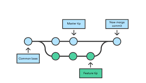
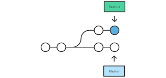

# Git in action: CLI

### Plan
1. Talk about Working directory,Staged Area and Local Repository.


#### Example
``` 
git init gittest   // initialising repository
cd gittest         // moving to directory
vi f1.txt          // editing the file
git status         // checking the status of the file
git add f1.txt     // Adding file to staged area 
git status
git commit f1.txt   // commiting the file in local repository
```
2. Explain what is branch and it's importance and explain with live examples.
#### Example
``` 
git checkout -b branchname  //creating a branch
```

3. Explain what is commit and need of commit and when it is to be done  with  live examples 
#### Example
```
git commit -m " file committed"   // commiting the file in local repository
```
4. Explain what is diff and when it is used with a live examples
#### Example
```
git checkout -b m1
vi f1.txt                   // write something to the file
git add f1.txt              // add it to staged area
git commit -m "committed"   // commiting the file in local repository
vi f2.txt                   // editing the file
git diff                    // comparing both the files
```

5. Explain the need of **.gitignore** with a live examples.

6. Explain how stashing works and how we can stash untracked files.
```
vi f12.txt          // write something to file
git add f12.txt     // add it to staged area
git stash           // store state of the file
```
#### to stash untracked files
```
git stash -u       // store state of the untracked file
```
7. Explaining the need of merging and pros and cons of doing it.



```
git merge branch1 branch2  // merging two branches
```
8. Explain the need of rebase, pros and cons and compare merge and rebase.



```
git rebase source target  // similar to merging but to use another branch as the new base for your work.
```
9. Explain the need of Master branch and how it is considered different from others and it's importance.

> Master is a state of code where the entire source code is safe to deploy in production.
> It is the main branch where all the changes get merged back in.


